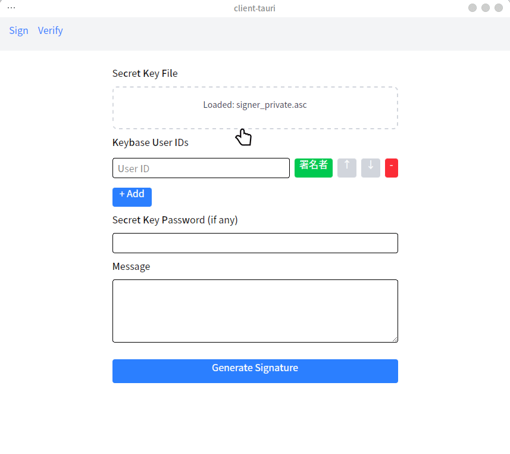
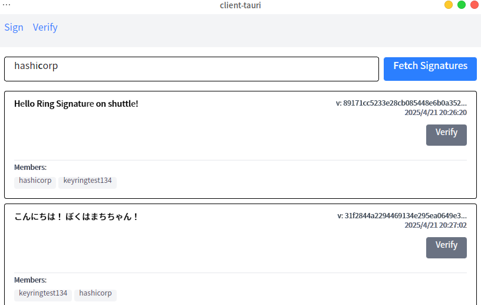

# RSA を用いたリング署名の簡易的実装

<p align="center">
  
</p>

## 概要

このプロジェクトは、Rust 言語を用いて RSA ベースのリング署名を実装したものです。Rivest, Shamir, Tauman による論文 "How to Leak a Secret" (2001) に基づき、RSA 署名を拡張し、対称鍵暗号（ChaCha20）を内部で使用しています。リング署名の概念とその数学的背景を理解し、実際に動作するコードを提供することを目的としています。

### 注意事項

このプログラムは、学習目的で作成されたサンプルプログラムです。実際のセキュリティアプリケーションでの使用は推奨いたしません。なお、著者はセキュリティの専門家ではなく、また専門家による検証を受けていないため、潜在的な脆弱性が存在する可能性があります。

数学的な誤り等がございましたら、Issue や Pull Request にてご指摘いただけると幸いです。

## 目次

- [1. リング署名とは](#1-リング署名とは)
  - [特徴](#特徴)
  - [本実装について](#本実装について)
- [2. 数学的背景](#2-数学的背景)
  - [2.1 RSA 署名の仕組み (復習)](#21-rsa-署名の仕組み-復習)
  - [2.2 拡張 RSA](#22-拡張-rsa)
  - [2.3 リング署名](#23-リング署名)
- [3. プロジェクト構造](#3-プロジェクト構造)
- [4. コードの概要](#4-コードの概要)
  - [主要なモジュール](#主要なモジュール)
  - [主要な機能](#主要な機能)
- [5. 使い方 (CLI)](#5-使い方-cli)
  - [5.1 鍵の準備](#51-鍵の準備)
    - [PEM 形式](#pem-形式-pem)
    - [PGP/GPG 形式](#pgpgpg-形式-asc)
  - [5.2 プログラムの実行](#52-プログラムの実行)
  - [5.3 実行例](#53-実行例)
- [6. 使い方 (GUI)](#6-使い方-gui)
  - [6.1 概要](#61-概要)
  - [6.2 実行](#62-実行)
    - [6.2.1 Keybase 鍵の準備](#621-keybase-鍵の準備)
    - [6.2.2 GUI アプリケーションの起動](#622-gui-アプリケーションの起動)
    - [6.2.3 サーバアプリケーションの起動](#623-サーバアプリケーションの起動)
  - [6.3 機能](#63-機能)
    - [6.3.1 リング署名の生成](#631-リング署名の生成)
    - [6.3.2 リング署名の検証](#632-リング署名の検証)
- [7. テスト](#7-テスト)
- [8. まとめと今後の展望](#8-まとめと今後の展望)
- [9. 貢献](#9-貢献)
- [10. ライセンス](#10-ライセンス)
- [11. 参考文献](#11-参考文献)

## 1. リング署名とは

リング署名は、公開鍵暗号の署名技術の一種で、複数の公開鍵の中から誰が署名したかを特定できないようにしつつ、その中の誰かが署名したことを証明できる技術です。

### 特徴

- **匿名性**: 署名者を特定できない。
- **自発性**: グループ内の他のメンバーの協力は不要。署名者は自身の秘密鍵と、他のメンバーの公開鍵（公開されているもので良い）のみで署名可能。

リング署名は、Monero などの匿名性の高い暗号通貨で採用され、取引のプライバシー保護に貢献しています。

### 本実装について

2001 年に発表された論文「How to Leak a Secret」を参考に、プログラミング言語 Rust でリング署名を実装しました。

- RSA 署名をベースに設計。
- 対称鍵暗号として ChaCha20 を使用。

## 2. 数学的背景

このセクションでは、リング署名の理解に必要な RSA 署名とその拡張について解説します。

### 2.1 RSA 署名の仕組み (復習)

RSA 署名は、公開鍵暗号方式の一つで、以下の要素で構成されます。

- **鍵生成:**

  1.  2 つの大きな素数 $p$, $q$ を選びます。
  2.  $n = p \cdot q$ を計算します。(これがモジュラス(modulus)となり、公開鍵の一部になります)
  3.  $\phi(n) = (p - 1)(q - 1)$ を計算します。(オイラーの φ 関数)
  4.  $1 < e < \phi(n)$ であり、 $e$ と $\phi(n)$ が互いに素(最大公約数が 1)となるような $e$ を選びます。( $e$ は公開指数と呼ばれ、公開鍵の一部です)
  5.  $d \cdot e \equiv 1 \pmod{\phi(n)}$ を満たす $d$ を計算します。( $d$ は秘密指数と呼ばれ、秘密鍵の一部です)

- **鍵ペア:**

  - 公開鍵: $(n, e)$
  - 秘密鍵: $(d, n)$ (または $d$ のみ)

  ここで、 $n$ (モジュラス)と $e$ (公開指数)は公開され、 $d$ (秘密指数)は秘密に保持されます。

- **署名生成:**

  1.  メッセージ $m$ のハッシュ値 $x = H(m)$ を計算します。
  2.  署名 $y = x^d \bmod n$ を計算します。(ここで秘密鍵の要素 $d$ を使用します)
  3.  メッセージ $m$ と署名 $y$ を送信します。

  この署名生成の計算式は、 $f(x) = x^d \bmod n$ と表され、RSA のトラップドア関数と呼ばれます。

- **署名検証:**

  1.  (受信者は)メッセージ $m$ のハッシュ値 $x = H(m)$ を計算します。
  2.  $x' = y^e \bmod n$ を計算します。(ここで公開鍵の要素 $e$ を使用します)
  3.  $x'$ と $x$ が一致すれば、署名は有効と判断します。

  署名検証の計算式は、 $f^{-1}(y) = y^e \bmod n$ と表され、これは署名生成関数の逆関数です。

### 2.2 拡張 RSA

リング署名では、通常の RSA のべき乗剰余演算を拡張した「拡張トラップドア関数」を導入します。これにより、異なる公開鍵を持つ複数のメンバーの計算結果を、同じ空間上で扱えるようになります。

- **拡張トラップドア関数 $g_i$:**

  入力 $x$ に対して、以下の計算を行います。

  1.  $x$ を $n_i$ (署名者 $i$ のモジュラス)で割った商 $q_i$ と余り $r_i$ を求めます ($x = q_i \cdot n_i + r_i$)。
  2.  $g_i(x_i) = q_i \cdot n_i +  f(x_i) = q_i \cdot n_i + r_i^{e_i} \mod n_i$ を計算します。 ($f(x_i)$ は通常の RSA のトラップドア関数、 $r_i^{e_i} \mod n_i$ と等価)

- **拡張トラップドア関数の逆関数 $g_i^{-1}$:**

  入力 $y$ に対して、以下の計算を行います。

  1.  $y$ を $n_i$ で割った商 $q_i$ と余り $r_i$ を求めます ($y = q_i \cdot n_i + r_i$)。
  2.  $g_i^{-1}(y_i) = q_i \cdot n_i + f^{-1}(y_i) = q_i \cdot n_i + r_i^{d_i} \mod n_i$ を計算します。($f^{-1}(y_i)$ は RSA トラップドア関数の逆関数、 $r_i^{d_i} \mod n_i$ と等価)

これらの関数は、公開鍵( $P_i$ )と秘密鍵( $S$ )に依存するため、それぞれ $g_i(x_i, P_i)$、 $g_i^{-1}(y_i, S)$ と表記します。

**重要な注意点:** $g_i$ および $g_i^{-1}$ の定義域は、通常の RSA における法 $n_i$ よりも大きく取る必要があります。これは、リング署名生成時にランダムに選ばれる値が $n_i$ より大きくなる可能性があるためです。実装では、鍵のビット長に定数を加算したビット長を定義域として採用します。

### 2.3 リング署名

リング署名は、特定のグループ（リング）のメンバーの誰かが署名したことを証明しつつ、具体的な署名者は秘匿する署名方式です。

**記号:**

- $R$: リング (署名に参加する全メンバーの公開鍵の集合)
- $P_i$: リングの $i$ 番目のメンバーの公開鍵
- $s$: 署名者のインデックス ($0 \le s < r$, $r$ はリングサイズ)
- $S$: 署名者の秘密鍵
- $k$: メッセージのハッシュ値 (対称鍵暗号の鍵として利用)
- $E_k(x)$: 鍵 $k$ による $x$ の対称鍵暗号化関数 (例: ChaCha20)
- $D_k(y)$: 鍵 $k$ による $y$ の対称鍵暗号復号関数
- $v$: グルー値 (リング署名の開始点と終了点をつなぐランダムな値)
- $x_i$: 各メンバー ( $i$ ) に対応する値 (署名者以外はランダム生成、署名者は逆算)
- $y_i$: $x_i$ に拡張 RSA トラップドア関数 $g(x_i, P_i)$ を適用した値
- $g(x, P)$: 拡張 RSA トラップドア関数
- $g^{-1}(y, S)$: 拡張 RSA トラップドア関数の逆関数
- $C_{k,v}(y_1, y_2, \dots, y_r)$: 結合関数

**結合関数 $C_{k,v}$:**

結合関数は、各メンバーの $y_i$ とグルー値 $v$ を入力とし、以下の計算を行います。

$C_{k,v}(y_1, y_2, \dots, y_r) = E_k( y_r \oplus E_k(y_{r-1} \oplus E_k(\cdots \oplus E_k(y_1 \oplus v)\cdots ))$

つまり、各 $y_i$ を鍵 $k$ で暗号化/復号しながら XOR で繋ぎ、最後に $v$ と XOR を取った値を出力します。この関数は一対一対応の性質を持ちます。

**署名生成:**

1.  **グルー値の生成:** ランダムな値 $v$ を生成します。
2.  **署名者以外の $x_i$, $y_i$ の生成:** 署名者 ($i = s$) 以外のメンバーについて、
    - ランダムな値 $x_i$ を生成します。
    - $y_i = g(x_i, P_i)$ を計算します。 ( $P_i$ は $i$ 番目のメンバーの公開鍵)
3.  $y_s$ **の逆算:** 結合関数 $C_{k,v}(y_1, y_2, \dots, y_r) = v$ という方程式が成り立つように、署名者の $y_s$ を逆算します。(結合関数が一対一対応であるため、 $y_s$ は一意に定まります)
4.  $x_s$ **の計算:** 署名者は、 $x_s = g^{-1}(y_s, S)$ を計算して自身の $x_s$ を求めます。(ここで署名者の秘密鍵 $S$ が必要になります)
5.  **署名の完成:** 全ての $x_i$ が揃ったら、署名が完了します。署名は $(P_1, P_2, \dots, P_r; \, v; \, x_1, x_2, \dots, x_r)$ の形式になります。

**署名検証:**

1.  **署名形式:** 検証者は、署名 $(P_1, P_2, \dots, P_r; \, v; \, x_1, x_2, \dots, x_r)$ を受け取ります。
2.  $y_i$ **の計算:** 各 $x_i$ に対して、 $y_i = g(x_i, P_i)$ を計算します。
3.  **鍵の算出:** メッセージ $m$ からハッシュ関数で鍵 $k = H(m)$ を計算します。
4.  **結合関数の計算:** $y_i$、 $k$ 、 $v$ を用いて結合関数 $C_{k,v}(y_1, y_2, \dots, y_r)$ を計算します。
5.  **検証:** 計算結果が $v$ と一致すれば、署名は正当と判断し、検証成功。一致しなければ署名は無効と判断します。

**ポイント:**

- 署名者は、自分の秘密鍵を使って $x_s$ を計算する部分*以外*は、他のメンバーの公開鍵のみを使って署名を生成できます。
- 検証者は、リングメンバー全員の公開鍵と署名データを使って検証を行いますが、誰が署名したかは特定できません。
- 結合関数が、リング署名の匿名性と検証可能性を実現する鍵となっています。

## 3. プロジェクト構造

プロジェクトの主要なディレクトリとファイルは以下の通りです。

## 4. コードの概要

### 主要なモジュール

- `crypto`: 暗号化関連の関数や構造体を含むモジュール。
- `rsa`: RSA 署名の生成と検証を行うモジュール。
- `ring`: リング署名の生成と検証を行うモジュール。
- `utils`: ユーティリティ関数を含むモジュール。

### 主要機能

- 対称鍵暗号関数 `e_k` / `d_k` (ChaCha20)
- 拡張 RSA トラップドア関数 `g` / `g_inverse`
- RSA 署名生成・検証関数
- リング署名生成・検証関数

### 実行の流れ

`main` 関数の処理フロー:

1.  RSA 鍵ペアの生成（複数）。
2.  各鍵ペアで RSA 署名の生成と検証テスト。
3.  複数の鍵ペアでリング署名を生成し、検証。

(スライド資料 3.2 のコード例と実行結果を参照)

## 5. 使い方 (CLI)

このセクションでは、コマンドラインインターフェース (CLI) 版のプログラムの使い方について説明します。CLI 版は `common` クレートに含まれており、基本的なリング署名の生成・検証機能を提供します。

### 5.1 鍵の準備

#### PEM 形式 (`*.pem`)

PEM 形式の鍵は、以下のように生成できます。

```bash
bash generate_pem_keys.sh
```

鍵生成の後、 `keys` ディレクトリに以下のファイルが生成されます。

- `signer_private.pem`: 署名者の秘密鍵
- `signer_public.pem`: 署名者の公開鍵
- `member1_public.pem`: メンバー 1 の公開鍵
- `member2_public.pem`: メンバー 2 の公開鍵

#### PGP/GPG 形式 (`*.asc`)

PGP/GPG 形式の鍵は、以下のように生成できます。

```bash
bash generate_pgp_keys.sh
```

鍵生成の後、 `keys` ディレクトリに以下のファイルが生成されます。

- `signer_private.asc`: 署名者の秘密鍵
- `member1_public.asc`: メンバー 1 の公開鍵
- `member2_public.asc`: メンバー 2 の公開鍵

### 5.2 プログラムの実行

ビルド済みのバイナリは、[https://github.com/calloc134/ring-signature/releases](https://github.com/calloc134/ring-signature/releases) からダウンロードできます。

バイナリをダウンロードして実行する場合は、以下のコマンドを実行します。

```bash
chmod +x ./common-tagname-x86_64-unknown-linux-gnu
./common-tagname-x86_64-unknown-linux-gnu
```

ソースから実行する場合、`common` ディレクトリ内で以下のコマンドを実行します。

```bash
cargo run
```

プロンプトで、どちらの鍵形式を使用するかを選択します。

その後、鍵のファイルパス ( PGP/GPG 形式の場合は秘密鍵のパスフレーズも必要 ) を入力します。
処理が開始され、リング署名が生成されます。
その後、署名の検証が行われ、結果が表示されます。

### 5.3 実行例

```
鍵ファイル形式を選択: pem
署名者秘密鍵ファイルパス: keys/signer_private.pem
署名者公開鍵ファイルパス: keys/signer_public.pem
メンバー1 公開鍵ファイルパス: keys/member1_public.pem
メンバー2 公開鍵ファイルパス: keys/member2_public.pem
[2025-04-19T13:12:28Z INFO  common] PGP証明書から鍵を読み込み中...
[2025-04-19T13:12:28Z INFO  common::rsa] Loading secret key from PEM: keys/signer_private.pem
[2025-04-19T13:12:28Z INFO  common::rsa] Secret key loaded successfully: n bits = 4096
[2025-04-19T13:12:28Z INFO  common::rsa] Loading public key from PEM: keys/signer_public.pem
[2025-04-19T13:12:28Z INFO  common::rsa] Public key loaded successfully: n bits = 4096, e = 65537
[2025-04-19T13:12:28Z INFO  common::rsa] Loading public key from PEM: keys/member1_public.pem
[2025-04-19T13:12:28Z INFO  common::rsa] Public key loaded successfully: n bits = 4096, e = 65537
[2025-04-19T13:12:28Z INFO  common::rsa] Loading public key from PEM: keys/member2_public.pem
[2025-04-19T13:12:28Z INFO  common::rsa] Public key loaded successfully: n bits = 4096, e = 65537
[2025-04-19T13:12:28Z INFO  common] 鍵の読み込み完了。
[2025-04-19T13:12:28Z INFO  common] 署名者のモジュラス n (先頭20文字): 69837846587028374360...
[2025-04-19T13:12:28Z INFO  common] メッセージ: Hello RSA and Ring Signature!
[2025-04-19T13:12:28Z INFO  common] RSAでメッセージに署名中...
[2025-04-19T13:12:28Z INFO  common::rsa] RSA署名生成開始: key.n bits = 4096, m bits = 256, b = 4256
[2025-04-19T13:12:28Z INFO  common::rsa] RSA署名生成完了: 4096 bits
[2025-04-19T13:12:28Z INFO  common] RSA署名 (hex): aa5fb7...
[2025-04-19T13:12:28Z INFO  common] RSA署名を検証中...
[2025-04-19T13:12:28Z INFO  common::rsa] RSA署名検証開始: pubkey.n bits = 4096, m bits = 256, signature bits = 4096, b = 4256
[2025-04-19T13:12:28Z INFO  common::rsa] RSA署名検証結果: true
[2025-04-19T13:12:28Z INFO  common] 通常RSA署名検証結果: true
[2025-04-19T13:12:28Z INFO  common] リング署名を生成中...
[2025-04-19T13:12:28Z INFO  common::ring] リング署名生成開始: ring_size = 3, signer = 0, m_len = 29, b = 4256
[2025-04-19T13:12:29Z INFO  common::ring] リング署名生成完了: v bits = 4253, xs_len = 3
[2025-04-19T13:12:29Z INFO  common] リング署名 グルー値 v (hex): 1e9d5f...
[2025-04-19T13:12:29Z INFO  common] リング署名を検証中...
[2025-04-19T13:12:29Z INFO  common::ring] リング署名検証開始: ring_size = 3, sig.v bits = 4253, sig.xs_len = 3, m_len = 29, b = 4256
[2025-04-19T13:12:29Z INFO  common::ring] リング署名検証結果: true
[2025-04-19T13:12:29Z INFO  common] リング署名検証結果: true
```

## 6. 使い方 (GUI)

このプロジェクトには、Tauri を使用した GUI アプリケーションも含まれています (`client-tauri` ディレクトリ)。GUI 版は、よりインタラクティブな方法でリング署名の生成と検証を行う機能を提供します。

### 6.1 概要

GUI アプリケーションは、ユーザーが PGP 鍵（Keybase からエクスポートしたもの）とメッセージ、複数の Keybase ユーザ ID を入力することで、リング署名を生成・検証することができます。

### 6.2 実行

まず環境を整える必要があります。以下の手順に従ってください。

#### 6.2.1 Keybase 鍵の準備

[Keybase](https://keybase.io/) を使用して、PGP 鍵を生成します。Keybase の CLI をインストールし、鍵を生成します。  
GUI の機能が正常に動作するためには、Keybase 上で鍵を生成する必要があります。

```bash
keybase pgp gen
```

次に、Web UI などを利用して、PGP 鍵をエクスポートし、ダウンロードします。


`Export my private key from Keybase`を選択することで、秘密鍵をローカル環境にダウンロードできます。

#### 6.2.2 GUI アプリケーションの起動

ビルド済みのバイナリは、[https://github.com/calloc134/ring-signature/releases](https://github.com/calloc134/ring-signature/releases) からダウンロードできます。

バイナリをダウンロードして実行する場合は、以下のコマンドを実行します。

```bash
chmod +x ./client-tauri_0.1.0_amd64-tagname-x86_64-unknown-linux-gnu.AppImage
./client-tauri_0.1.0_amd64-tagname-x86_64-unknown-linux-gnu.AppImage
```

ソースから実行する場合、`client-tauri` ディレクトリに移動し、必要な依存関係をインストールします。

```bash
cd client-tauri
pnpm install
```

環境が整ったら、`client-tauri` ディレクトリ内で以下のコマンドを実行します。

```bash
# 開発モードで起動
pnpm tauri dev
```

#### 6.2.3 サーバアプリケーション

GUI アプリケーションは、サーバーアプリケーションと連携して動作します。

サーバアプリケーションは、既に Shuttle を利用して [https://ring-signature-0oqe.shuttle.app/](https://ring-signature-0oqe.shuttle.app/) でデプロイされています。

環境変数の `VITE_BACKEND_URL` を設定することで、サーバーアプリケーションの URL を指定できます。

### 6.3 機能

#### 6.3.1 リング署名の生成


Secret Key FIle では、ファイルを選択し秘密鍵を指定します。

Keybase User IDs では、リング署名に参加するメンバーの Keybase ユーザ ID を追加します。署名者の場合は、右側のボタンを押すことで署名者として指定できます。順番の変更も行うことができます。


Secret Key Password では、秘密鍵にパスフレーズが存在する場合に入力します。
Message では、リング署名を生成するメッセージを入力します。

Generate Signature ボタンを押すことで、リング署名が生成されます。

#### 6.3.2 リング署名の検証


ユーザ ID を入力することで、対象ユーザがリングに含まれた署名を一覧で表示することができます。



右側の Verify ボタンを押すことで、選択した署名の検証を行います。検証結果は、署名が有効か無効かを示すメッセージとして表示されます。


## 7. テスト

各モジュールにはユニットテストが実装されており、主要な機能の正当性を確認しています。

- **`common::crypto_utils`**:
  - 対称鍵暗号化 (`e_k`) と復号 (`d_k`) の一貫性テスト。
  - 異なるビット長 (`b`) での暗号化・復号の動作確認。
- **`common::rsa`**:
  - RSA 署名生成 (`rsa_sign`) と検証 (`rsa_verify`) の成功ケース。
  - RSA 署名検証が異なるメッセージで失敗するケース。
  - 拡張 RSA トラップドア関数 `g` とその逆関数 `g_inverse` の相互逆元関係テスト。
  - `g` および `g_inverse` 関数の境界値（0, n 付近, n の倍数）での動作確認。
  - 素数生成 (`gen_prime_exact`) の基本的な動作確認。
  - モジュラ逆数 (`modinv`) 計算の成功・失敗ケース。
- **`common::ring`**:
  - リング署名生成 (`ring_sign`) と検証 (`ring_verify`) の成功ケース。
  - リング署名検証が異なるメッセージで失敗するケース。
  - リング署名生成時のエラーハンドリング（空リング、無効な署名者インデックス）。
  - リング内の異なるメンバーが署名した場合の検証成功テスト。

テストはプロジェクトルート、または各クレート (`common`, `server`, `client-tauri`) 内で以下のコマンドで実行できます。

```bash
cargo test
```

## 8. まとめと今後の展望

RSA 署名を基にリング署名を実装し、その仕組みの理解を深めました。CLI、GUI、およびサーバーコンポーネントを通じて、異なる利用シナリオに対応する基盤が構築されています。
今後は、他の暗号方式を用いたリング署名の実装、サーバー API の拡充、GUI の機能強化、実際のアプリケーションへの応用などを検討したいと考えています。

## 9. 貢献

バグ報告、機能提案、プルリクエストなど、歓迎します。

## 10. ライセンス

このプロジェクトは [MIT License](LICENSE) のもとで公開されています。

## 11. 参考文献

- Rivest, R. L., Shamir, A., & Tauman, Y. (2001). How to leak a secret. In _Advances in Cryptology—ASIACRYPT 2001_ (pp. 552-565). Springer Berlin Heidelberg. ([https://www.iacr.org/archive/asiacrypt2001/22480554.pdf](https://www.iacr.org/archive/asiacrypt2001/22480554.pdf))
