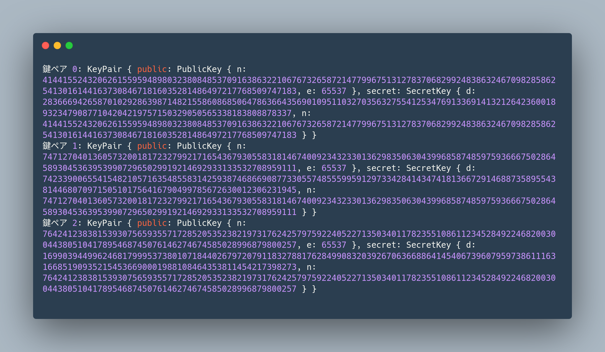

# RSA を用いたリング署名の簡易的実装

---

## 1. リング署名とは？

### 1.1 リング署名

- 公開鍵暗号の署名の応用
- 署名に対応する公開鍵が複数存在する
- 公開鍵のメンバーのうち誰かが署名したことを証明できる
- どの鍵を使って署名されたのかを特定できない

---

### 1.2 特徴

- グループ内のメンバーの協力を得る必要はない
  - 署名者自身の秘密鍵と、他のメンバーの公開鍵だけで署名可能
    公開されている第三者の公開鍵をいくつか準備すれば良い
- 2001 年に 論文「How to Leak a Secret」として発表された
  - https://www.iacr.org/archive/asiacrypt2001/22480554.pdf
- 後発の研究でさらなる高速化が検討
- Monero に代表される秘匿性の高い一部の暗号通貨で採用

---

### 1.3 今回の実装

- 論文を元にプログラミング言語 Rust でリング署名を実装
  - 情報セキュリティで学習した RSA 署名をベースとして設計
  - 内部で対称鍵暗号(ストリーム暗号) ChaCha20 を使用

---

## 2. 数学的背景

### 2.1 RSA 署名の仕組みの復習 (1/4)

- **鍵生成:**
  1.  2 つの大きな素数 $p$, $q$ を選ぶ
  2.  $n = p \cdot q$ を計算する
  3.  $\phi(n) = (p - 1)(q - 1)$ を計算する
  4.  $1 < e < \phi(n)$ かつ $e$ と $\phi(n)$ が互いに素となるように $e$ を選択
  - $e$ は公開指数と呼ばれ、公開鍵の一部として公開
  5.  $d \cdot e \equiv 1 \pmod{\phi(n)}$ を満たす $d$ を計算する

---

### 2.1 RSA 署名の仕組みの復習 (2/4)

- 公開鍵: $(n, e)$と 秘密鍵: $(d, n)$ のペア

- $n$: モジュラス (modulus)
  - 公開鍵の一部として公開
  - 暗号化や署名、復号や検証の際に $\bmod n$ で剰余を取る
- $e$: 公開指数
  - 公開鍵の一部として公開
- $d$: 秘密指数

  - 秘密鍵の一部として秘密に保持

---

### 2.1 RSA 署名の仕組みの復習 (3/4)

- **署名生成:**

  1.  メッセージ $m$ のハッシュ値 $x = H(m)$ を計算する。
  2.  署名 $y = x^d \bmod n$ を計算する。

  - ここで秘密鍵の要素である $d$ を使用

  3.  メッセージ $m$ と署名 $y$ を送信する。

署名を生成する計算式を抜き出すと、$f(x) = x^d \bmod n$ となる。
この関数を、RSA のトラップドア関数と呼称する。

---

### 2.1 RSA 署名の仕組みの復習 (4/4)

- **署名検証:**
  1. メッセージ $m$ のハッシュ値 $x = H(m)$ を計算する。
  2. $x' = y^e \bmod n$ を計算する。
  - ここで公開鍵の要素である $e$ を使用
  3. $x'$と$x$が一致すれば、署名は有効。

署名を検証する計算式を抜き出すと、$f^{-1}(y) = y^e \bmod n$ となる。
これは、署名生成を行う関数の逆関数である。

---

### 2.2 拡張 RSA (1/2)

リング署名を実装するにあたり、通常の RSA のべき乗剰余演算 $f(x) = x^d \bmod n$ を拡張した拡張トラップドア関数を導入する。
リング署名のように異なる公開鍵を持つ複数のメンバーが関わる計算において、各メンバーの計算結果を同じ定義域・値域（空間）で扱えるようになる。

- 入力 $x$ を$n_i$で割り算し、商 $q_i$ と余り $r_i$ を導出
- $g_i(x_i) = q_i \cdot n_i +  f(x_i) = q_i \cdot n_i + r_i^{e_i} \mod n_i$ と定義

---

### 2.2 拡張 RSA (2/2)

また、逆関数 $g_i^{-1}(y)$ についても同様に定義する。

- 入力 $y$ を$n_i$で割り算し、商 $q_i$ と余り $r_i$ を導出
- $g_i^{-1}(y_i) = q_i \cdot n_i + f^{-1}(y_i) = q_i \cdot n_i + r_i^{d_i} \mod n_i$ と定義

なお、これらの関数はそれぞれ公開鍵と秘密鍵に依存するため、
$g_i(x_i, P_i)$ 、$g_i^{-1}(y_i, S)$ と表記する。

$g_i$ および $g_i^{-1}$ の定義域は、通常の RSA における法 $n_i$ より大きく取る必要がある。これは、リング署名生成時にランダムに選ばれる値が $n_i$ より大きくなる可能性があるためである。実装では、鍵のビット長に定数を加算したビット長を定義域として採用する。

---

### 2.3 リング署名 (1/6)

- **登場する変数:**

  - $R$: リング
    - 署名に参加する全てのメンバーの公開鍵の集合
  - $P_i$: リングの $i$ 番目のメンバーの公開鍵
  - $s$: 署名者のインデックス
    - $0 \le s < r$ ($r$はリングサイズ)
  - $S$: 署名者の秘密鍵
  - $k$: メッセージのハッシュ値
    - 対称鍵暗号の鍵として利用される

---

### 2.3 リング署名 (2/6)

- $E_k(x)$: 鍵 (ハッシュ値) $k$ による $x$ の対称鍵暗号の暗号化関数
  - 元の論文では方式を特に限定していないため、ここでは ChaCha20 を使用
- $D_k(y)$: 鍵 (ハッシュ値) $k$ による $y$ の対称鍵暗号の復号関数
- $v$: グルー値
  - リング署名の開始点と終了点をつなぐランダムな値
  - 検証時に結合関数の出力がこの $v$ に一致するかどうかで署名検証
- $x_i$: 各メンバー（$i$）に対応する値
  - 署名者でない ($i \ne s$) 場合はランダム生成
  - 署名者 ($i = s$) の場合は逆算で求める
- $y_i$: $x_i$に対して拡張 RSA トラップドア関数$g(x_i, P_i)$を適用した値

---

### 2.3 リング署名 (3/6)

- $g(x, P)$: 拡張 RSA トラップドア関数 (解説済み)
- $g^{-1}(y, S)$: 拡張 RSA トラップドア関数の逆関数 (解説済み)
- $C_{k,v}(y_1, y_2, \dots, y_r)$: 結合関数
  - $C_{k,v}(y_1, y_2, \dots, y_r) = E_k( y_r \oplus E_k(y_{r-1} \oplus E_k(\cdots \oplus E_k(y_1 \oplus v)\cdots ))$
  - 入力: $y_1, y_2, \dots, y_r$ (各メンバーの $y_i$)、 $v$ (グルー値)
  - 出力: 全ての$y_i$を$k$で暗号化(もしくは復号)を繰り返し、$v$と結合した値。

---

### 2.3 リング署名 (4/6)

- **署名生成:**
  1.  $v$ をランダム生成
  2.  $i \ne s$ （署名者以外のメンバー）に対して:
      - $x_i$ をランダム生成
      - それぞれの$x_i$に対応する$y_i = g(x_i, K_i)$を計算
  3.  結合関数 $C_{k,v}(y_1, y_2, \dots, y_r) = v$ の方程式が成り立つように
      署名者の秘密値 $x_s$ に対応する $y_s$ を逆算
  - 結合関数は一対一の性質を持つため、$y_s$ の解は一意に定まる

---

### 2.3 リング署名 (5/6)

- **署名生成:**

  4.  署名者は、 $x_s = g^{-1}(y_s, S)$ を計算して自身の$x_s$を求める

  - この計算において、署名者の秘密鍵が必要となる

  5.  以上で全ての $x_i$ が揃い、署名生成が完了
  6.  署名は $(P_1, P_2, \dots, P_r; \, v; \, x_1, x_2, \dots, x_r)$ の形式で構成される

---

### 2.3 リング署名 (6/6)

- **署名検証:**

  1.  署名は $(P_1, P_2, \dots, P_r; \, v; \, x_1, x_2, \dots, x_r)$ の形式で構成される
  2.  検証者は、各 $x_i$ から $y_i = g(x_i, P_i)$ を計算する。
  3.  メッセージ $m$ からハッシュ関数で鍵 $k = h(m)$ を算出する。
  4.  $y_i$、$k$、$v$ を用いて結合関数 $C_{k,v}(y_1, y_2, \dots, y_r)$ を計算し、出力が $v$ と一致するか確認する。
  5.  一致すれば署名は正当であり、検証は成功。一致しなければ署名は無効。

---

## 3. コードの概要

- RSA を用いた、通常署名・リング署名の生成・検証を実現
- プログラミング言語 Rust を用いて実装

---

### 3.1 主要な機能

- 主要な機能:
  - 対称鍵暗号関数 e_k / d_k (ChaCha20 を採用)
  - 拡張 RSA トラップドア関数 g / g_inverse
  - RSA 署名生成・検証関数
  - リング署名生成・検証関数

---

### 3.2 実行の流れ (1/4)

- main 関数の流れ:

  1. 乱数生成器を用いて RSA 鍵ペアを生成
  2. 各鍵ペアの RSA 署名を生成し、検証するテストを実施
  3. 複数の鍵ペアを用いてリング署名を生成し、リング全体で署名検証を確認

- 出力例（実行時）:
  - 個々の鍵ペア情報の表示
  - RSA 署名とその検証結果の表示
  - リング署名のグルー値や各 x_i の値の表示
  - リング署名検証の最終結果

---

### 3.2 実行の流れ (2/4)

```rust
fn main() {
    // 鍵ペアの生成と表示
    for (i, keypair) in keypair_vec.iter().enumerate() {
        println!("鍵ペア {}: {:?}", i, keypair);
    }

    // RSA署名生成・検証
    let signature = rsa_sign(&keypair_vec[0], &m, b);
    println!("署名: {}", signature);

    let rsa_verify_result = rsa_verify(&keypair_vec[0].public, &m, &signature, b);
    println!("通常RSA署名検証結果: {}", rsa_verify_result);

    // リング署名生成・検証
    let ring_sig = ring_sign(&keypair_vec, 0, message, b);
    println!("リング署名のグルー値v: {}", ring_sig.v);

    let ring_sig_verify_result = ring_verify(&ring_pubs, &ring_sig, message, b);
    println!("リング署名検証結果: {}", ring_sig_verify_result);
}
```

---

### 3.2 実行の流れ (3/4)



---

### 3.2 実行の流れ (4/4)

.png>)

---

### 3.3 コードの構成 (1/8)

- **定数定義**:
  - `E`: 公開指数
    - RSA 暗号で一般的に使用される値 65537
  - `COMMON_DOMAIN_BIT_LENGTH_ADDITION`: 共通定義域のビット長に追加するビット数。
    - 署名生成時にランダムに選ばれる値が n より大きくなる可能性があるため
      鍵のビット長に定数を加算したビット長を定義域として採用。
  - `FIXED_NONCE`: ChaCha20 で使用する固定ノンス

---

### 3.3 コードの構成 (2/8)

- **構造体定義**:
  - `PublicKey`: RSA 公開鍵
    - モジュラス `n` と公開指数 `e` を含む
  - `SecretKey`: RSA 秘密鍵
    - 秘密指数 `d` とモジュラス `n` を含む
  - `KeyPair`: RSA 鍵ペア
    - 公開鍵と秘密鍵をペアで保持
  - `RingSignature`: リング署名
    - グルー値 `v` と各メンバーの寄与 `xs` を含む

---

### 3.3 コードの構成 (3/8)

- **利用する外部クレート**:
  - `num_bigint`: 大きい整数の計算
  - `num_integer`: 整数関連のユーティリティ
    - 拡張ユークリッド互除法の計算など
  - `num_traits`: 数値型に関するトレイト
  - `chacha20`: ChaCha20 ストリーム暗号の実装
  - `rand`: 乱数生成
  - `sha3`: SHA-3 ハッシュ関数
  - `num_prime`: 素数の生成と判定

---

## 4. テストと検証について

- ユニットテストを多数実装し、以下の観点から各関数の正当性を確認

* **暗号化/復号:** 対称暗号の正当性
* **RSA 署名:** 成功/失敗ケース
* **リング署名:** 成功/失敗、空リング
* **`g`関数, `g_inverse`関数:** 正当性、ゼロ、境界値
* **数論関数:** 素数生成、モジュラ逆数、拡張ユークリッド互除法
* **境界値/エラー:** 各種関数の境界値、エラー処理

---

## 5. まとめ

今回の実装では、授業で学習した RSA 署名の仕組みを元に、応用としてリング署名の実装を行った。かねてから存在を知っていたリング署名について、実際に論文を読みながら実装を行うことで、ある程度仕組みについて理解が深めることができたように思う。
今後の展望として、RSA ではなく他の暗号方式を用いたリング署名の実装や、実際のアプリケーションへの応用を考えていきたい。
