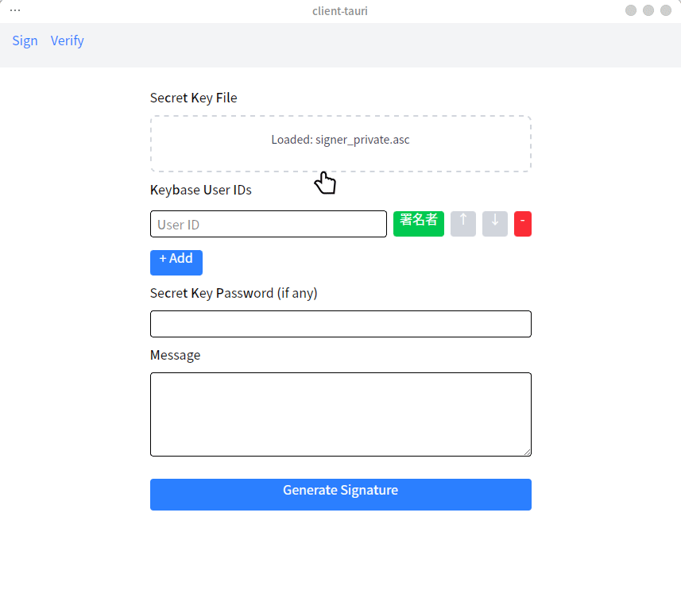
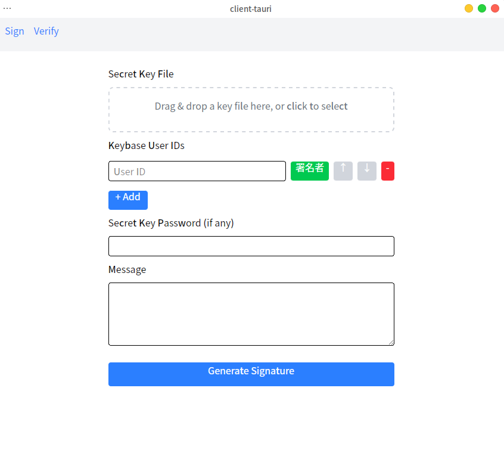
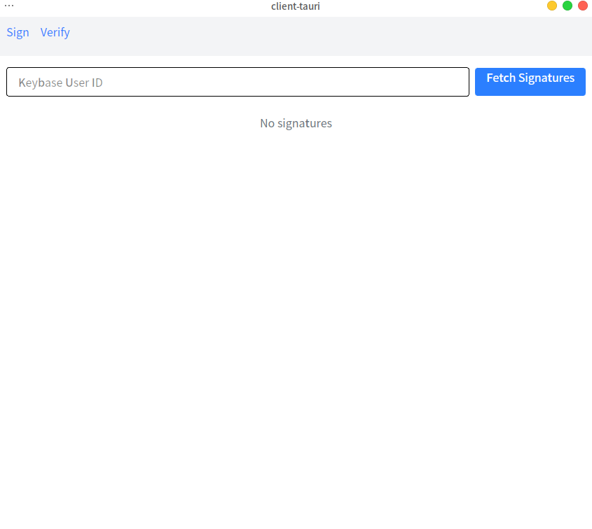
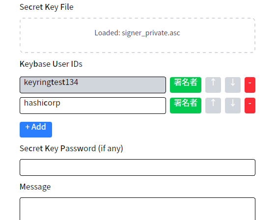

# RSA を用いたリング署名の簡易的実装

---

## 目次

0. 前提
1. 何を作ったのか
2. なぜ作ったのか
3. どのように作ったのか
4. 理論的背景
5. 工夫した点
6. 苦労した点
7. 今後の展望
8. 参考文献

---

## 0. 前提

リング署名とは

- 複数の公開鍵のうち、誰かが署名したことを証明
- 具体的に「誰が」署名したかはわからない
- RSA などの公開鍵暗号を基盤とした応用技術
- 理論は後ほど解説

---

## 1. 何を作ったのか

**リング署名の生成・検証をするアプリケーション**



- CLI 版と GUI 版を実装
- Keybase のユーザー鍵と連携して動作
- サーバーとクライアントのアーキテクチャ

---

### 1.1 機能概要: CLI 版

```
鍵ファイル形式を選択: pem
署名者秘密鍵ファイルパス: keys/signer_private.pem
... (公開鍵ファイルパス入力) ...
[INFO] 鍵の読み込み完了。
[INFO] リング署名を生成中... ring_size = 3, signer = 0
[INFO] リング署名生成完了: v bits = ..., xs_len = 3
[INFO] リング署名を検証中...
[INFO] リング署名検証結果: true
```

- PEM/PGP 形式の鍵ファイルを利用
- リング署名の生成と検証が可能

---

### 1.2 機能概要: GUI 版

<!-- <div style="display: flex; justify-content: space-between;">
  <div style="flex: 1;">
    
  </div>
  <div style="flex: 1;">
    
  </div>
</div> -->



- Keybase ユーザー鍵との連携
- シンプルで直感的な UI
- バックエンドサーバーとの
  通信による処理

---

## 2. なぜ作ったのか

**匿名性と信頼性の両立**

- 内部告発や匿名投票など、身元を隠しつつ信頼性を担保する場面での活用
- 「この特定のグループの誰かが確かに発言した」ということだけを証明
- Keybase との連携により身近なユースケースを実現

> 例: 企業の役員会の誰かが内部告発をしたい場合、
> 「役員の誰か」という情報は公開しつつ、具体的に誰かは秘匿できる

---

### 2.1 既存技術と本実装の位置付け

- リング署名は Monero など一部の暗号通貨で採用されているが
  一般アプリケーションでは普及していない
- 実用的なツールとして
  Keybase の PGP 鍵エコシステムと連携することで敷居を下げる

---

## 3. どのように作ったのか

**論文の理論を Rust で実装**

- 基本アルゴリズム: Rivest, Shamir, Tauman (2001) "How to Leak a Secret"
- 実装言語: Rust（安全性・パフォーマンス重視）
- アーキテクチャ:
  - `common`: コア暗号ロジック（RSA、拡張 RSA、リング署名）
  - `server`: バックエンド API (Shuttle)
  - `client-tauri`: GUI フロントエンド (Tauri)

---

### 3.1 実装の詳細

```rust
// リング署名生成の核となる部分
pub fn ring_sign(
  ...
) -> Result<RingSignature> {
    // 1. 初期チェック
    // 2. ハッシュ値（対称鍵）の生成
    // 3. グルー値vのランダム生成
    // 4. 署名者以外のxiをランダム生成してyiを計算
    // 5. ysを逆算して求める（結合関数が成立するように）
    // 6. 署名者のxsを計算（秘密鍵が必要）
    // 7. 署名を構成して返却
}
```

- 論文のアルゴリズムを Rust コードに落とし込み
- 数学的構造を維持しながら実用的な実装に

---

## 4. 理論的背景

### 4.1 リング署名とは

- 複数の公開鍵（リング）のうち、誰かが署名したことを証明
- ただし具体的に「誰が」署名したかは秘匿
- RSA などの公開鍵暗号を基盤とした応用技術

---

### 4.2 RSA 署名の仕組み（復習）

- **鍵生成:**

  - 素数 $p, q$ から $n = p \cdot q$, $\phi(n) = (p-1)(q-1)$
  - 公開指数 $e$ と秘密指数 $d$ ($d \cdot e \equiv 1 \pmod{\phi(n)}$)

- **署名:**

  - メッセージハッシュ値 $x = H(m)$
  - 署名 $y = x^d \bmod n$ (秘密鍵で計算)

- **検証:**
  - $x' = y^e \bmod n$ を計算
  - $x' = x$ なら有効

---

### 4.3 リング署名の数学的構造

**核となる要素:**

1. **拡張 RSA トラップドア関数:**

   - $g_i(x) = q_i \cdot n_i + r_i^{e_i} \bmod n_i$ (入力 $x = q_i n_i + r_i$)
   - $g_i^{-1}(y) = q_i \cdot n_i + r_i^{d_i} \bmod n_i$ (入力 $y = q_i n_i + r_i$)

2. **結合関数:**
   - $C_{k,v}(y_1,...,y_r) = E_k(y_r \oplus E_k(...\oplus E_k(y_1 \oplus v)))$
   - $E_k$: 対称鍵暗号化関数（本実装では ChaCha20）

---

### 4.4 署名と検証の流れ

**署名生成:**

1. ランダムな値 $v$ (グルー値) を生成
2. 署名者以外の $x_i$ をランダム生成、$y_i = g_i(x_i)$ を計算
3. $C_{k,v}(y_1,...,y_r) = v$ となるように $y_s$ を逆算
4. 署名者の $x_s = g_s^{-1}(y_s)$ を秘密鍵で計算
5. 署名 $(P_1,...,P_r; v; x_1,...,x_r)$ を生成

**検証:**

1. 各 $x_i$ から $y_i = g_i(x_i)$ を計算
2. 結合関数 $C_{k,v}(y_1,...,y_r)$ の値が $v$ と一致するか確認
3. 一致すれば署名は有効

---

## 5. 工夫した点

### 5.1 技術的新規性

1. **ChaCha20 での実装:**

   - 論文では対称暗号方式を限定していない
   - 現代的で高速な ChaCha20 を採用

2. **Rust での安全な実装:**
   - メモリ安全性の保証
   - 型システムを活用した堅牢なコード設計

---

### 5.2 UX の観点からの新規性

3. **Keybase との連携:**

   - 既存の PGP 鍵エコシステムと接続
   - ユーザー ID からの公開鍵取得を自動化
   - より想定しやすいユースケースを実現

4. **直感的な UI 設計:**
   - 複雑な暗号技術をシンプルに操作可能
   - リング署名の生成・検証の操作を視覚化

---

## 6. 苦労した点

### 6.1 理論からコードへの変換

- 論文の数学的表現をコードに落とし込む難しさ
  - 特に拡張 RSA 関数の実装
  - 数学的な理論を理解する必要があった
- コード品質の向上
  - コード分割
  - テストの充実
  - ロギング

---

### 6.2 技術的課題

- **ChaCha20 の実装:**

  - 元論文での XOR をどのように ChaCha20 に変更するか
  - ChaCha20 クレートの使い方の学習

- **PGP 鍵の読み込み:**
  - Rust の`sequoia-openpgp`クレートの使い方が難解
  - 既存のコード・内部実装を読んでなんとか理解
  - 鍵データ構造の解析と変換の複雑さ

---

## 7. 今後の展望

改良・拡張したい点:

1. **機能拡張:**

   - GUI の機能強化
   - API 機能の強化

2. **応用例のバリエーション:**
   - 匿名投票システム
   - 内部告発プラットフォーム

---

## 8. 参考文献

- Rivest, R. L., Shamir, A., & Tauman, Y. (2001). How to leak a secret. In _Advances in Cryptology—ASIACRYPT 2001_ (pp. 552-565). Springer Berlin Heidelberg.

  - [https://www.iacr.org/archive/asiacrypt2001/22480554.pdf](https://www.iacr.org/archive/asiacrypt2001/22480554.pdf)

- The Rust Programming Language. [https://doc.rust-lang.org/book/](https://doc.rust-lang.org/book/)

- Keybase API Documentation. [https://keybase.io/docs/api/1.0](https://keybase.io/docs/api/1.0)
