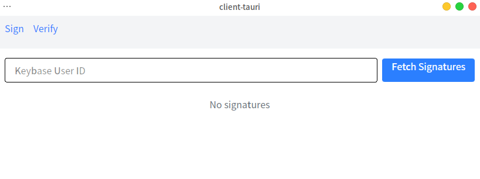
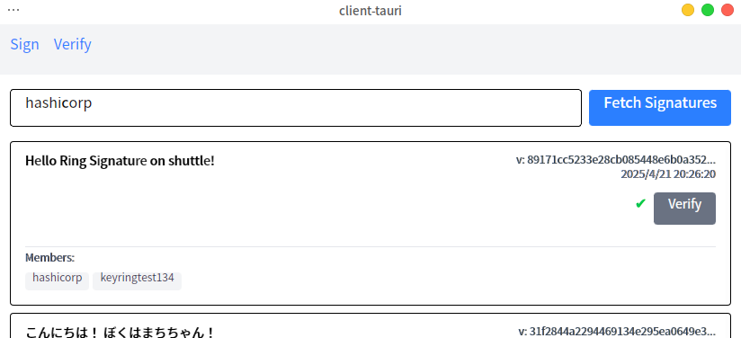

# RSA を用いたリング署名の簡易的実装

<p align="center">
  
</p>

---

## 1. リング署名とは？

### 1.1 リング署名

- 公開鍵暗号の署名の応用
- 署名に対応する公開鍵が複数存在する
- 公開鍵のメンバーのうち誰かが署名したことを証明できる
- どの鍵を使って署名されたのかを特定できない

---

### 1.2 特徴

- **匿名性**: 署名者を特定できない
- **自発性**: グループ内のメンバーの協力を得る必要はない
  - 署名者自身の秘密鍵と、他のメンバーの公開鍵だけで署名可能
    公開されている第三者の公開鍵をいくつか準備すれば良い
- 2001 年に 論文「How to Leak a Secret」として発表された
  - https://www.iacr.org/archive/asiacrypt2001/22480554.pdf
- Monero に代表される秘匿性の高い一部の暗号通貨で採用

---

### 1.3 今回の実装

- 論文を元にプログラミング言語 Rust でリング署名を実装
  - 情報セキュリティで学習した RSA 署名をベースとして設計
  - 内部で対称鍵暗号(ストリーム暗号) ChaCha20 を使用
- **注意:** 学習目的のサンプル。実際のセキュリティ用途非推奨。

---

## 2. 数学的背景

### 2.1 RSA 署名の仕組みの復習 (1/4)

- **鍵生成:**
  1.  2 つの大きな素数 $p$, $q$ を選ぶ
  2.  $n = p \cdot q$ を計算する
  3.  $\phi(n) = (p - 1)(q - 1)$ を計算する
  4.  $1 < e < \phi(n)$ かつ $e$ と $\phi(n)$ が互いに素となるように $e$ を選択
  - $e$ は公開指数と呼ばれ、公開鍵の一部として公開
  5.  $d \cdot e \equiv 1 \pmod{\phi(n)}$ を満たす $d$ を計算する

---

### 2.1 RSA 署名の仕組みの復習 (2/4)

- 公開鍵: $(n, e)$と 秘密鍵: $(d, n)$ のペア

- $n$: モジュラス (modulus)
  - 公開鍵の一部として公開
  - 暗号化や署名、復号や検証の際に $\bmod n$ で剰余を取る
- $e$: 公開指数
  - 公開鍵の一部として公開
- $d$: 秘密指数

  - 秘密鍵の一部として秘密に保持

---

### 2.1 RSA 署名の仕組みの復習 (3/4)

- **署名生成:**

  1.  メッセージ $m$ のハッシュ値 $x = H(m)$ を計算する。
  2.  署名 $y = x^d \bmod n$ を計算する。

  - ここで秘密鍵の要素である $d$ を使用

  3.  メッセージ $m$ と署名 $y$ を送信する。

署名を生成する計算式を抜き出すと、$f(x) = x^d \bmod n$ となる。
この関数を、RSA のトラップドア関数と呼称する。

---

### 2.1 RSA 署名の仕組みの復習 (4/4)

- **署名検証:**
  1. メッセージ $m$ のハッシュ値 $x = H(m)$ を計算する。
  2. $x' = y^e \bmod n$ を計算する。
  - ここで公開鍵の要素である $e$ を使用
  3. $x'$と$x$が一致すれば、署名は有効。

署名を検証する計算式を抜き出すと、$f^{-1}(y) = y^e \bmod n$ となる。
これは、署名生成を行う関数の逆関数である。

---

### 2.2 拡張 RSA (1/2)

リング署名を実装するにあたり、通常の RSA のべき乗剰余演算 $f(x) = x^d \bmod n$ を拡張した拡張トラップドア関数を導入する。
リング署名のように異なる公開鍵を持つ複数のメンバーが関わる計算において、各メンバーの計算結果を同じ定義域・値域（空間）で扱えるようになる。

- 入力 $x$ を$n_i$で割り算し、商 $q_i$ と余り $r_i$ を導出
- $g_i(x_i) = q_i \cdot n_i +  f(x_i) = q_i \cdot n_i + r_i^{e_i} \mod n_i$ と定義

---

### 2.2 拡張 RSA (2/2)

また、逆関数 $g_i^{-1}(y)$ についても同様に定義する。

- 入力 $y$ を$n_i$で割り算し、商 $q_i$ と余り $r_i$ を導出
- $g_i^{-1}(y_i) = q_i \cdot n_i + f^{-1}(y_i) = q_i \cdot n_i + r_i^{d_i} \mod n_i$ と定義

なお、これらの関数はそれぞれ公開鍵と秘密鍵に依存するため、
$g_i(x_i, P_i)$ 、$g_i^{-1}(y_i, S)$ と表記する。

$g_i$ および $g_i^{-1}$ の定義域は、通常の RSA における法 $n_i$ より大きく取る必要がある。これは、リング署名生成時にランダムに選ばれる値が $n_i$ より大きくなる可能性があるためである。実装では、鍵のビット長に定数を加算したビット長を定義域として採用する。

---

### 2.3 リング署名 (1/6)

- **登場する変数:**

  - $R$: リング
    - 署名に参加する全てのメンバーの公開鍵の集合
  - $P_i$: リングの $i$ 番目のメンバーの公開鍵
  - $s$: 署名者のインデックス
    - $0 \le s < r$ ($r$はリングサイズ)
  - $S$: 署名者の秘密鍵
  - $k$: メッセージのハッシュ値
    - 対称鍵暗号の鍵として利用される

---

### 2.3 リング署名 (2/6)

- $E_k(x)$: 鍵 (ハッシュ値) $k$ による $x$ の対称鍵暗号の暗号化関数
  - 元の論文では方式を特に限定していないため、ここでは ChaCha20 を使用
- $D_k(y)$: 鍵 (ハッシュ値) $k$ による $y$ の対称鍵暗号の復号関数
- $v$: グルー値
  - リング署名の開始点と終了点をつなぐランダムな値
  - 検証時に結合関数の出力がこの $v$ に一致するかどうかで署名検証
- $x_i$: 各メンバー（$i$）に対応する値
  - 署名者でない ($i \ne s$) 場合はランダム生成
  - 署名者 ($i = s$) の場合は逆算で求める
- $y_i$: $x_i$に対して拡張 RSA トラップドア関数$g(x_i, P_i)$を適用した値

---

### 2.3 リング署名 (3/6)

- $g(x, P)$: 拡張 RSA トラップドア関数 (解説済み)
- $g^{-1}(y, S)$: 拡張 RSA トラップドア関数の逆関数 (解説済み)
- $C_{k,v}(y_1, y_2, \dots, y_r)$: 結合関数
  - $C_{k,v}(y_1, y_2, \dots, y_r) = E_k( y_r \oplus E_k(y_{r-1} \oplus E_k(\cdots \oplus E_k(y_1 \oplus v)\cdots ))$
  - 入力: $y_1, y_2, \dots, y_r$ (各メンバーの $y_i$)、 $v$ (グルー値)
  - 出力: 全ての$y_i$を$k$で暗号化(もしくは復号)を繰り返し、$v$と結合した値。

---

### 2.3 リング署名 (4/6)

- **署名生成:**
  1.  $v$ をランダム生成
  2.  $i \ne s$ （署名者以外のメンバー）に対して:
      - $x_i$ をランダム生成
      - それぞれの$x_i$に対応する$y_i = g(x_i, K_i)$を計算
  3.  結合関数 $C_{k,v}(y_1, y_2, \dots, y_r) = v$ の方程式が成り立つように
      署名者の秘密値 $x_s$ に対応する $y_s$ を逆算
  - 結合関数は一対一の性質を持つため、$y_s$ の解は一意に定まる

---

### 2.3 リング署名 (5/6)

- **署名生成:**

  4.  署名者は、 $x_s = g^{-1}(y_s, S)$ を計算して自身の$x_s$を求める

  - この計算において、署名者の秘密鍵が必要となる

  5.  以上で全ての $x_i$ が揃い、署名生成が完了
  6.  署名は $(P_1, P_2, \dots, P_r; \, v; \, x_1, x_2, \dots, x_r)$ の形式で構成される

---

### 2.3 リング署名 (6/6)

- **署名検証:**

  1.  署名は $(P_1, P_2, \dots, P_r; \, v; \, x_1, x_2, \dots, x_r)$ の形式で構成される
  2.  検証者は、各 $x_i$ から $y_i = g(x_i, P_i)$ を計算する。
  3.  メッセージ $m$ からハッシュ関数で鍵 $k = h(m)$ を算出する。
  4.  $y_i$、$k$、$v$ を用いて結合関数 $C_{k,v}(y_1, y_2, \dots, y_r)$ を計算し、出力が $v$ と一致するか確認する。
  5.  一致すれば署名は正当であり、検証は成功。一致しなければ署名は無効。

---

## 3. プロジェクト構造

- `common/`: コア暗号ロジック
  - 対称鍵暗号、RSA、リング署名の実装
- `server/`: バックエンド API (Shuttle でデプロイ)
- `client-tauri/`: GUI アプリケーション (Tauri)
- `keys/`: サンプル鍵ファイル (PEM, PGP/ASC)
- `images/`: README やスライド用画像
- `scripts/`: 鍵生成スクリプト

---

## 4. コードの概要

### 主要なモジュール (`common` クレート内)

- `crypto_utils`: 対称鍵暗号 (ChaCha20) 関連
- `rsa`: RSA 署名、拡張 RSA 関数
- `ring`: リング署名の生成・検証
- `utils`: ユーティリティ関数 (BigUint 変換など)

### 主要機能

- 対称鍵暗号関数 `e_k` / `d_k`
- 拡張 RSA トラップドア関数 `g` / `g_inverse`
- リング署名生成・検証関数 `ring_sign` / `ring_verify`

---

## 5. 使い方 (CLI)

### 5.1 鍵の準備

- **PEM 形式:** `bash generate_pem_keys.sh`
- **PGP/GPG 形式:** `bash generate_pgp_keys.sh`
  - `keys/` ディレクトリに鍵が生成される

### 5.2 プログラムの実行

- **ビルド済みバイナリ:** Releases からダウンロード
- **ソースから:** `common` ディレクトリで `cargo run`
  - プロンプトに従い、鍵形式とファイルパスを入力

---

### 5.3 CLI 実行例

```
鍵ファイル形式を選択: pem
署名者秘密鍵ファイルパス: keys/signer_private.pem
... (公開鍵ファイルパス入力) ...
[INFO] 鍵の読み込み完了。
[INFO] メッセージ: Hello RSA and Ring Signature!
[INFO] RSAでメッセージに署名中...
[INFO] RSA署名検証結果: true
[INFO] リング署名を生成中... ring_size = 3, signer = 0
[INFO] リング署名生成完了: v bits = ..., xs_len = 3
[INFO] リング署名を検証中...
[INFO] リング署名検証結果: true
```

---

## 6. 使い方 (GUI)

### 6.1 概要

- Tauri を使用した GUI アプリケーション (`client-tauri`)
- Keybase の PGP 鍵を使用
- メッセージと複数の Keybase ユーザ ID を入力してリング署名を生成・検証
- バックエンドサーバ (`server` クレート) と連携

---

### 6.2 実行手順

1. **Keybase 鍵の準備:**
   - `keybase pgp gen` で鍵生成
   - Keybase から秘密鍵をエクスポートしてダウンロード
     
2. **GUI アプリケーションの起動:**
   - ビルド済みバイナリ: AppImage を実行
   - ソースから: `cd client-tauri && pnpm install && pnpm tauri dev`
3. **サーバ:** デプロイ済み ([https://ring-signature-0oqe.shuttle.app/](https://ring-signature-0oqe.shuttle.app/)) を利用

---

### 6.3 機能: リング署名の生成


- 秘密鍵ファイル、パスフレーズ (必要時) を指定
- メッセージを入力
- リングメンバーの Keybase ユーザ ID を追加 (署名者を指定)
- "Generate Signature" ボタンで生成

---

### 6.3 機能: リング署名の検証



- Keybase ユーザ ID を入力すると、関連する署名一覧を表示
- "Verify" ボタンで選択した署名を検証
- 検証結果は有効/無効のメッセージとして表示



---

## 7. テスト

各モジュールにユニットテストを実装 (`cargo test` で実行)

- **`crypto_utils`**: 対称鍵暗号の一貫性テスト
- **`rsa`**:
  - RSA 署名/検証の正当性確認
  - 拡張 RSA 関数の相互逆元関係テスト
  - 境界値テスト (0, n 付近, n 倍数)
- **`ring`**:
  - リング署名/検証の成功・失敗ケース
  - エラーハンドリング (空リング、無効なインデックス)

---

## 8. まとめと今後の展望

- RSA ベースのリング署名を Rust で実装し、その仕組みを理解
- CLI, GUI, サーバ のコンポーネント構築
- **今後の展望:**
  - 他の暗号方式 (例: EdDSA) ベースのリング署名
  - 機能拡張 (GUI, API)
  - 応用例の検討

---

## 9. 参考文献

- Rivest, R. L., Shamir, A., & Tauman, Y. (2001). How to leak a secret. In _Advances in Cryptology—ASIACRYPT 2001_ (pp. 552-565). Springer Berlin Heidelberg.
  - [https://www.iacr.org/archive/asiacrypt2001/22480554.pdf](https://www.iacr.org/archive/asiacrypt2001/22480554.pdf)
